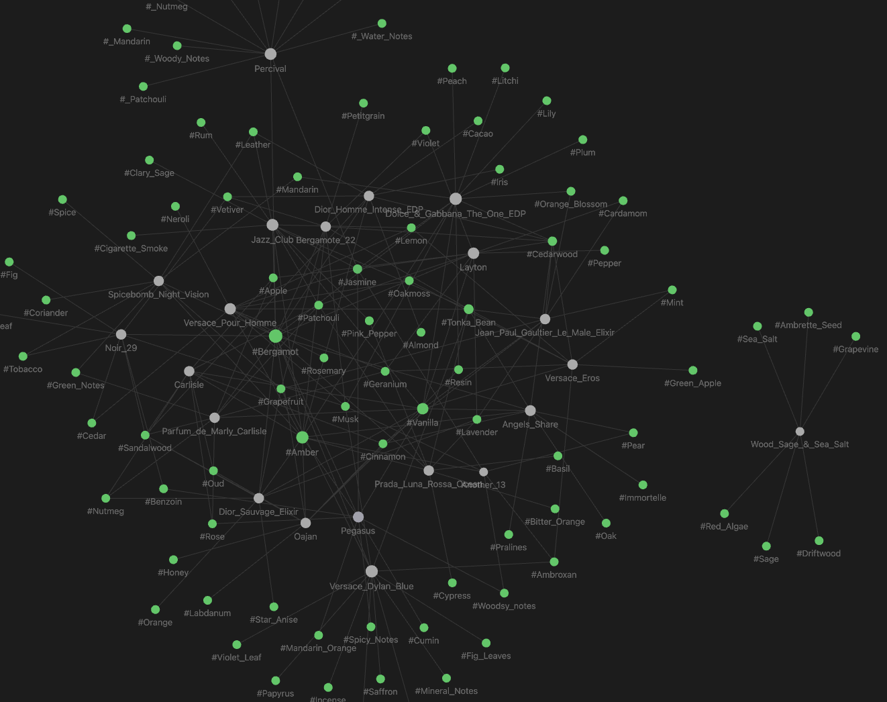

# Fragrance-Index

<p align="center">
  
</p>


Fragrance-Index is a Python-based tool for managing and organizing fragrance information. It allows users to process fragrance images, retrieve note information, and store the data in both a local JSON store and as individual Markdown files compatible with Obsidian.


## Features

- Recognize fragrances from images
- Retrieve fragrance notes using an API
- Save fragrance information to a local JSON store
- Generate Markdown files for each fragrance, compatible with Obsidian
- Process bulk fragrance lists from a file
- Utilize local caching to reduce API calls

## Using the Script

To use the script from the command line:

1. Ensure you have a text file with a list of fragrances, one per line.

2. Run the script with the path to your fragrances file:
   ```
   python src/fragrance_index/main.py --path path/to/your/fragrances.txt
   ```

   Replace `path/to/your/fragrances.txt` with the actual path to your file.

3. The script will process each fragrance in the file:
   - If the fragrance is already in the local store, it will use the cached data.
   - If not, it will fetch the fragrance notes from the API and save them to the local store.
   - For each fragrance, it will create a Markdown file in the `mapped_fragrances` directory.

4. After processing, you'll find:
   - Updated `fragrance_store.json` with any new fragrances
   - New or updated Markdown files in the `mapped_fragrances` directory

This method is efficient for processing multiple fragrances at once, especially if you have a large list of fragrances to index.


## Setup

1. Clone this repository:
   ```
   git clone https://github.com/ParthSareen/Fragrance-Index.git
   cd Fragrance-Index
   ```

2. Install the required dependencies:
   ```
   pip install -r requirements.lock
   ```

3. Set up your API keys in a `.env` file:
   ```
   OPENAI_API_KEY=your_openai_api_key
   ```

## Usage

1. To process a single fragrance image:
   ```python
   fragrance_index = FragranceIndex()
   fragrance = fragrance_index.process_and_save_fragrance("path/to/your/image.jpg")
   ```

2. To process a list of fragrances from a file:
   ```python
   fragrance_index = FragranceIndex()
   fragrance_index.run_bulk_fragrance_saving("path/to/your/fragrance_list.txt")
   ```

## Output

- Fragrance data is saved in a JSON file named `fragrance_store.json`
- Individual Markdown files for each fragrance are created in the `mapped_fragrances` directory
- These Markdown files can be used with Obsidian for linking and graph visualization

## TODO
-[] structure jsons better 
-[] mongodb
-[] build simple graph connection UI (reactflow?)
